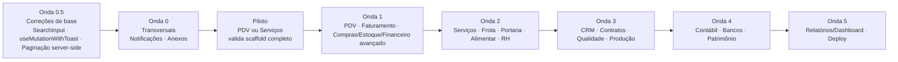

# Plano Mestre — Frontend Logosoft

> **Arquivo único e fonte de verdade operacional.** Consolida em um só lugar: contexto e convenções, a auditoria
> de qualidade da base atual com as correções, o plano de criação de todas as telas novas (por módulo) e o roadmap
> integrado de execução. É o documento a partir do qual as telas, melhorias e correções serão operadas.
>
> **Fonte da verdade dos contratos:** DTOs/controllers do backend em `../New project 3/src/Erp.Application/<Modulo>/**`
> e `../New project 3/src/Erp.Api/Controllers/<Modulo>/**`. Em divergência de payload, **o backend prevalece**.
> Especificação bruta de origem: [`DOCUMENTACAO-FRONTEND-MODULOS-NOVOS.md`](../DOCUMENTACAO-FRONTEND-MODULOS-NOVOS.md) (na raiz).

## Índice
- [Parte A — Contexto, stack e convenções](#parte-a--contexto-stack-e-convenções)
- [Parte B — Auditoria de qualidade e correções de base](#parte-b--auditoria-de-qualidade-e-correções-de-base)
- [Parte C — Plano de criação das telas (por módulo)](#parte-c--plano-de-criação-das-telas-por-módulo)
- [Parte D — Roadmap integrado de execução](#parte-d--roadmap-integrado-de-execução)
- [Parte E — Definition of Done, permissões e riscos](#parte-e--definition-of-done-permissões-e-riscos)

---

# Parte A — Contexto, stack e convenções

## A.1 Objetivo e escopo
Construir as telas do `logosoft-frontend` (Next.js 13 / App Router) que **ainda não existem** e cobrem os módulos
do backend (Ondas 1–6 + backlog `.1`), **e** corrigir os padrões de base atuais antes de escalar. O núcleo já cobre:
`administracao, atividades, auditoria, auth, clientes, compras (pedido), dashboard, estoque, financeiro, fiscal,
fornecedores, pessoas, produtos, relatorios, seguranca, tabelas-preco, vendas`.

**Fora de escopo:** refazer auth/refresh (já existe); recriar seletor de empresa/filial; alterar contratos de backend.

## A.2 Stack
| Camada | Tecnologia |
|---|---|
| Framework | Next.js 13.4.8 (App Router) |
| UI | PrimeReact 10.2.1 + PrimeFlex + PrimeIcons |
| Estado de servidor | @tanstack/react-query v5 |
| HTTP | axios (`lib/http/httpClient.ts`, refresh JWT transparente) |
| Formulários | react-hook-form + zod (`@hookform/resolvers`) |
| Gráficos | chart.js |
| Linguagem | TypeScript (`strict: true`) |
| Testes | vitest (unit/component) + @playwright/test (e2e) |

## A.3 Anatomia de uma feature (padrão obrigatório)
```
features/<modulo>/
  api/<modulo>Api.ts             → 1 objeto axios por recurso + builders parseSchema()
  hooks/use<Modulo>Resources.ts  → useQuery (listas/detalhe) + useMutation (ações) + query keys
  schemas/<modulo>Schemas.ts     → zod (validação + sanitização de payload)
  types/<modulo>.types.ts        → tipos TS espelhando DTOs (Request/Response)
  components/*.tsx               → <Modulo>Page (DataTable) + *FormDialog + *Dialog de ações
  tests/{unit,components,e2e}    → gates de teste
app/(main)/<modulo>/page.tsx     → só importa e renderiza <Modulo>Page
```
Referência canônica: [`features/produtos`](../features/produtos). Espelhar a mecânica de `produtosApi.ts`
(`runRequest` + `parseSchema` + `params()` com `cleanQueryParams`) e `useProdutosResources.ts` (query keys + `invalidateQueries`).

## A.4 Infra compartilhada já disponível (não recriar)
| Necessidade | Usar |
|---|---|
| HTTP + refresh JWT | `lib/http/httpClient.ts` |
| Normalização de erro | `mapApiError` (`lib/http/apiError.ts`) |
| Limpeza de query/payload/GUID | `cleanQueryParams`, `sanitizePayload`, `isValidGuid` (`lib/http/requestUtils.ts`) |
| Permissões | `hasPermission/hasAnyPermission/hasAllPermissions` (`lib/permissions`) + `usePermissions()` |
| Gate de rota | `lib/security/routePermissions.ts` |
| Toast | `useAppToast` (`hooks/useAppToast.ts`) |
| Filtro empresa/filial | `components/forms/EmpresaFilialFilter.tsx` |
| Tabela / status / ações | `DataTableServer`, `StatusTag`, `DataTableActions` (`components/data/*`) |
| Diálogo de motivo obrigatório | `ReasonDialog` (`components/feedback/ReasonDialog.tsx`) |
| Gate de UI por permissão | `PermissionGuard` (`components/security/PermissionGuard.tsx`) |
| Estados vazios/erro/sem acesso | `EmptyState`, `ApiErrorPanel`, `UnauthorizedState`, `LoadingState` |
| Cabeçalho de página | `PageHeader` (`components/common/PageHeader.tsx`) |
| Inputs especializados | `MoneyInput`, `PercentInput`, `QuantityInput`, `DateInput`, `EntitySelect`, `SearchSelect` |

## A.5 Três registros centrais obrigatórios por módulo (fáceis de esquecer)
Além da feature, **todo módulo novo** toca 3 arquivos centrais:
1. **`types/erp.ts` → union `PermissionCode`** (linha ~197): adicionar cada código `UPPER_SNAKE`. Sem isso, o TS recusa `hasPermission('...')`. **É o gargalo mais comum.**
2. **`lib/security/routePermissions.ts`**: `RoutePermissionRule` para a nova rota-base. Regra **específica antes** da genérica (padrão já usado em `/estoque/*`).
3. **`layout/AppMenu.tsx`**: item de menu com `permission`/`anyPermissions`.

## A.6 Convenções travadas
- **Multiempresa:** `empresaId`(+`filialId?`) em **query params** nas listas (GET) e no **corpo** nas criações (POST). Vem do contexto de sessão — nunca criar seletor por módulo.
- **Enums numéricos** (maioria inicia em 1), trafegam como número; manter mapa `valor→rótulo` e exibir como `StatusTag`/`Tag`.
- **Datas** ISO 8601 (`DateTimeOffset`); `Calendar`.
- **Monetário/decimal** via `InputNumber`; GUIDs de relacionamento via `Dropdown`/`EntitySelect` alimentado por `useQuery`.
- **Ações com motivo/evidência/justificativa** → sempre `Dialog`/`ReasonDialog` com campo obrigatório.
- **Gating:** botão de ação só aparece com a permissão do endpoint; rota exige `<MODULO>_CONSULTAR`.
- **Erros:** `mapApiError` → toast; validação de negócio = HTTP 400 `message`; concorrência/único = 409. Exibir `Alertas` retornados por operações.

---

# Parte B — Auditoria de qualidade e correções de base

> Varredura da base atual (`features/**`, `components/**`, `styles/**`). A base é bem estruturada; os defeitos são
> **sistêmicos e repetidos**, concentrados em listagem/tabela e boilerplate — corrigir o padrão compartilhado
> conserta dezenas de telas de uma vez. **Estas correções são pré-requisito dos módulos novos** (ver Onda 0.5 na Parte D).
> **Severidade:** 🔴 Alta · 🟡 Média · 🟢 Baixa.

## B.1 Achados

| # | Achado | Sev. | Alcance |
|---|---|---|---|
| 1 | Paginação "lazy" falsa (client disfarçada de server) | 🔴 | 22 páginas |
| 2 | Busca sem debounce + full-scan de todos os campos | 🔴 | ~20 páginas |
| 3 | Registros acima de ~500 ficam invisíveis | 🔴 | todas as listas |
| 4 | Boilerplate `try/catch + toast` repetido | 🟡 | 76 ocorrências |
| 5 | Nome enganoso `DataTableServer` | 🟡 | componente base |
| 6 | Duplicação da search-bar (UI copiada) | 🟢 | ~8 páginas |
| 7 | Inputs de busca sem `label`/`aria-label` | 🟡 | ~8 toolbars |
| 8 | Tabelas só `responsiveLayout="scroll"` no mobile | 🟡 | todas as tabelas |
| 9 | Ações de linha não colapsam em telas estreitas | 🟡 | listas com 3+ ações |
| 10 | Sem ordenação de colunas | 🟢 | todas as listas |
| 11 | ~18 arquivos sem classes responsivas (verificar) | 🟢 | 18 de 71 |

## B.2 Detalhe e recomendação

**🔴 1. Paginação "lazy" falsa — 22 páginas.** `components/data/DataTableServer.tsx` usa `lazy` (sinaliza server-side),
mas as páginas passam o array inteiro e fatiam no cliente (`records.slice(first, first+rows)`, `totalRecords={records.length}`);
`onPage` não refetcha. A lista inteira trafega/fica em memória; o paginator é cosmético.
*Afetadas:* administracao, atividades, clientes, compras (2), estoque (5), financeiro (3), fornecedores, pessoas, produtos (2), seguranca (2), tabelas-preco, vendas (2).
**✅ Decisão (2026-07-16): paginação server-side real.** `api.listar` recebe `{ page, pageSize, termo, sort }` e devolve
`PagedResult<T>` (tipo já existe em `types/erp.ts`); `onPage`/`onSort` entram na `queryKey` e **refetcham**. Manter `lazy`
(agora correto) e renomear/documentar o componente. Requer alinhar endpoints com o backend. Migração incremental
(piloto + listas transacionais grandes primeiro).

**🔎 Investigação do backend (`../New project 3`) — 2026-07-17:**
- **`PagedResult<T>`** do backend (`src/Erp.Shared/Kernel/PagedResult.cs`) = `{ Items, Page, PageSize, TotalItems, TotalPages, HasNextPage, HasPreviousPage }` → **compatível** com o `PagedResult<T>` do frontend (camelCase no JSON).
- **Params de paginação**: `page` (default 1) + `pageSize` (default 20) + `termo` + filtros. **Sem `sort` server-side** (ordenação não é suportada por query hoje).
- **Controllers que JÁ paginam**: Atividades, Auditoria, TabelasPreco, EstoqueAvancado, FinanceiroAvancado, Notificacoes, Integracoes.
- **Núcleo NÃO pagina** (só `empresaId/filialId/termo`, retorna array): **Produtos, Clientes, Fornecedores, Pessoas, Estoque, Financeiro** (e provavelmente os demais cadastros). São exatamente as listas que mais crescem (>500) → **o fix de maior valor exige mudança no backend**.
- **Frontend meio-pronto**: `atividadesApi.ts` já importa `PagedResult`, aceita `Response[] | PagedResult<Response>`, envia `page/pageSize` e tem `normalizeList` — mas **descarta `totalItems`** e achata para array (a página ainda pagina no cliente). Migrar = parar de achatar + expor `totalItems` no hook + `page/pageSize` na `queryKey` + `totalRecords={totalItems}` na página.

**Conclusão / caminhos:**
- **(A) Sem tocar no backend:** migrar para server-side real **só** as telas cujo backend já pagina que existem no frontend hoje — **Atividades** e **TabelasPreco** (e Auditoria). Núcleo permanece client-side: renomear `DataTableServer`→`DataTableClient`/documentar e assumir o teto ~500. Módulos novos já nascem paginados.
- **(B) Com backend:** adicionar `page/pageSize` aos controllers do núcleo (Produtos, Clientes, Fornecedores, Pessoas, Estoque, Financeiro) em `../New project 3`, depois migrar tudo. Resolve B#1/B#3 de fato, mas é trabalho no repositório do backend.

**🔴 2. Busca sem debounce + full-scan.** `filterLocal` roda `Object.values(record).some(...)` por registro a cada tecla
(7 páginas); `hooks/useDebouncedValue.ts` existe mas só em 2 páginas. **Rec.:** debounce 250–300 ms em todas as buscas;
com server-side (#1), busca vira query `termo` e o full-scan some.

**🔴 3. Acima de ~500 registros = invisível** (consequência de #1) e o full-scan casa com **GUIDs/enums/datas** (matches confusos).
**Rec.:** resolver via server-side; restringir busca a campos textuais relevantes.

**🟡 4. Boilerplate `try/catch + toast` (76×).** Cada ação repete sucesso/erro manual. **Rec.:** helper `useMutationWithToast`
(ou `onSuccess`/`onError` no hook de recurso) — reduz ~76 blocos a 1 linha e uniformiza mensagens.

**🟡 5. Nome enganoso `DataTableServer`** (ver #1) — induz cópia do antipadrão. **Rec.:** renomear conforme a decisão de paginação.

**🟢 6. Search-bar duplicada em ~8 telas.** **Rec.:** `<SearchInput value onChange debounceMs label />` compartilhado resolve #2, #5, #6, #7 juntos.

**🟡 7. Inputs de busca sem rótulo** — só `placeholder="Buscar"`. Placeholder não substitui label para leitores de tela.
*Obs.:* os **form dialogs estão corretos** (`label htmlFor` + `FieldError` + grid responsivo). O gap é só nas toolbars.
**Rec.:** `aria-label`/`label` — resolvido pelo `<SearchInput>` do #6.

**🟡 8. Tabelas só scroll horizontal no mobile.** Telas densas (Produtos = 7 colunas) ficam ruins no celular.
**Rec.:** ocultar colunas secundárias por breakpoint (`hidden md:table-cell`); avaliar layout stack/card no mobile.

**🟡 9. Ações de linha não colapsam.** `DataTableActions` renderiza botões label+ícone em `flex-wrap`; 3–4 ações empilham em telas estreitas.
**Rec.:** colapsar em `SplitButton`/menu kebab abaixo de `md`.

**🟢 10. Sem ordenação** — só 1 coluna `sortable`/1 `onSort` na base. **Rec.:** habilitar `sortable` nas colunas-chave (trivial no client-side; no server-side entra com `onSort`).

**🟢 11. Cobertura responsiva** — 53/71 arquivos usam `md:`/`lg:`/`col-`; ~18 não. **Rec.:** varrer os 18 para confirmar que não há layout fixo quebrando.

## B.3 Pontos fortes (preservar como padrão)
- ✅ Camadas limpas (api/hooks/schemas/types/components).
- ✅ Form dialogs acessíveis (`label htmlFor`, grid `col-12 md:col-X`, `FieldError`, `safeParse`, `TabView`).
- ✅ Gating de permissão consistente (`PermissionGuard` hide/disable + `usePermissions`).
- ✅ Governança: TS `strict`, gate `validate` = `validate:source + typecheck + lint + test`, **0 `console.log`**.
- ✅ Reuso de `EmpresaFilialFilter`, `ReasonDialog`, `ApiErrorPanel`, `EmptyState`, `StatusTag`, `PageHeader`.

## B.4 Ordem das correções de base (custo-benefício)
1. **`<SearchInput>` compartilhado** (debounce + a11y) → resolve #2, #7, #6, parte de #3. *Baixo esforço, alto alcance.*
2. **`useMutationWithToast`** → resolve #4. *Baixo esforço.*
3. **Paginação server-side real** + renome do componente → resolve #1, #3, #5, #10. *Médio; decisão arquitetural principal.*
4. **Densidade responsiva de tabela** (colunas por breakpoint + overflow menu de ações) → #8, #9. *Médio.*
5. **Varredura dos 18 arquivos** sem breakpoints → #11. *Baixo.*

---

# Parte C — Plano de criação das telas (por módulo)

> Convenções das tabelas: caminho relativo a `baseURL` (`appConfig.apiUrl`); `{id}` = GUID; "Perm." = permissão exigida.
> Payloads listam campos do `Request` (camelCase no JSON). Tamanho: **P** (1 recurso) · **M** (2–3 recursos/wizard) · **G** (muitos recursos/abas ou fluxo atômico crítico).
> ⚠️ **Todos os códigos de permissão abaixo são propostos** (PascalCase backend → `UPPER_SNAKE`). **Confirmar cada um contra o JWT do backend** antes de fechar o union `PermissionCode`.

## Inventário
| # | Módulo | Rota-base nova | Onda backend | Tam. |
|---|---|---|---|---|
| C.1 | Compras avançado | `compras/{solicitacoes,cotacoes,recebimentos}` | a43 | G |
| C.2 | Estoque avançado | `estoque/avancado` | reuso | M |
| C.3 | Financeiro avançado | `financeiro/avancado` | — | M |
| C.4 | Faturamento | `faturamento` | a41 | M |
| C.5 | Bancos/Boletos/CNAB | `bancos`, `bancos/boletos`, `bancos/cnab` | a42 | G |
| C.6 | Produção | `producao/{fichas-tecnicas,ordens}` | a44 | G |
| C.7 | Contábil | `contabil/{plano-contas,periodos,lancamentos,regras}` | a45 | G |
| C.8 | Patrimônio | `patrimonio/{bens,depreciacao,inventarios}` | a46 | G |
| C.9 | CRM | `crm/{leads,oportunidades,propostas}` | a47 | G |
| C.10 | Qualidade (+ `controlaQualidade`) | `qualidade/{inspecoes,nao-conformidades}` | a48/a48.1 | G |
| C.11 | Contratos | `contratos` | a49 | M |
| C.12 | Serviços (OS) | `servicos/ordens` | a50 | M/G |
| C.13 | PDV | `pdv/{caixas,vendas}` | a51 | G |
| C.14 | Frota | `frota/{veiculos,motoristas,viagens}` | a52/a52.1 | G |
| C.15 | Portaria | `portaria` | a53 | M |
| C.16 | RH | `rh/{colaboradores,jornadas,ponto,ausencias,beneficios,eventos}` | a54 | G |
| C.17 | Alimentar | `alimentar/{lotes,recalls}` | a55/a55.1 | M |
| C.18 | Transversais (Notificações, Anexos, Relatórios/Dashboard, Deploy) | global + `administracao/deploy` | a57 | — |

---

### C.1 Compras avançado (a43) — G
**Rotas:** `compras/solicitacoes`, `compras/cotacoes`, `compras/recebimentos`.
**Fluxo:** Solicitação (Rascunho→Aprovada) → Cotação vinculada (aprovar **gera Pedido de Compra**) → Recebimento → Divergências automáticas → Conferência fiscal da NF de entrada.

| Verbo | Caminho | Perm. | Payload |
|---|---|---|---|
| GET | `/api/compras/solicitacoes` `/{id}` | COMPRAS_SOLICITACOES_CONSULTAR | query empresa/filial |
| POST | `/api/compras/solicitacoes` | COMPRAS_SOLICITACOES_GERENCIAR | `CriarSolicitacaoCompraRequest` |
| POST | `/api/compras/solicitacoes/{id}/itens` | COMPRAS_SOLICITACOES_GERENCIAR | item (produto, qtd) |
| POST | `/api/compras/solicitacoes/{id}/aprovar` | COMPRAS_SOLICITACOES_APROVAR | — |
| POST | `/api/compras/solicitacoes/{id}/cancelar` | COMPRAS_SOLICITACOES_GERENCIAR | `{ motivo }` |
| GET | `/api/compras/cotacoes` `/{id}` | COMPRAS_COTACOES_CONSULTAR | — |
| POST | `/api/compras/cotacoes` | COMPRAS_COTACOES_GERENCIAR | `CriarCotacaoCompraRequest` |
| POST | `/api/compras/cotacoes/{id}/itens` | COMPRAS_COTACOES_GERENCIAR | item (produto, qtd, valor) |
| POST | `/api/compras/cotacoes/{id}/aprovar` | COMPRAS_COTACOES_APROVAR | — (gera pedido) |
| POST | `/api/compras/cotacoes/{id}/recusar` \| `/cancelar` | COMPRAS_COTACOES_GERENCIAR | `{ motivo }` |
| GET | `/api/compras/recebimentos/{id}` `/divergencias` | COMPRAS_CONSULTAR | query |
| POST | `/api/compras/recebimentos/{id}/conferencia-fiscal` | COMPRAS_CONFERENCIA_FISCAL_REGISTRAR | dados da NF |
```ts
CriarSolicitacaoCompraRequest = { empresaId, filialId?, numero, dataSolicitacao, solicitante, justificativa? }
CriarCotacaoCompraRequest = { empresaId, filialId?, numero, fornecedorId, dataCotacao, validade?, solicitacaoCompraId?, observacao? }
```
**Aceite:** aprovar cotação cria pedido (mostrar link); divergências destacadas; ações respeitam permissões específicas.
**Perms. novas:** COMPRAS_SOLICITACOES_CONSULTAR/GERENCIAR/APROVAR, COMPRAS_COTACOES_CONSULTAR/GERENCIAR/APROVAR, COMPRAS_CONFERENCIA_FISCAL_REGISTRAR.

### C.2 Estoque avançado — M (abas)
**Rota:** `estoque/avancado` (abas Inventários operacionais · Ajustes · Bloqueios).
**Fluxo:** Inventário op. (abrir→itens→iniciar contagem→concluir/cancelar); Ajuste pontual (entrada/saída c/ motivo); Bloqueio (bloquear→liberar/cancelar).

| Verbo | Caminho | Perm. |
|---|---|---|
| POST/GET | `/api/estoque/avancado/inventarios` `/{id}` | EstoqueInventarioGerenciar / EstoqueConsultar |
| POST | `/api/estoque/avancado/inventarios/{id}/itens` | EstoqueInventarioGerenciar |
| POST | `/api/estoque/avancado/inventarios/{id}/iniciar-contagem` \| `/concluir` \| `/cancelar` | EstoqueInventarioGerenciar |
| POST | `/api/estoque/avancado/ajustes` | EstoqueAjustar |
| POST | `/api/estoque/avancado/bloqueios` `/{id}/liberar` `/{id}/cancelar` | EstoqueBloqueioGerenciar |

**Nota:** esta tela é o ponto de **liberação** dos bloqueios criados por Qualidade (reprovação) e Alimentar (recall) — exige permissão + motivo.
**Perms. novas:** ESTOQUE_AJUSTAR, ESTOQUE_BLOQUEIO_GERENCIAR (ESTOQUE_INVENTARIO_GERENCIAR já existe).

### C.3 Financeiro avançado — M
**Rota:** `financeiro/avancado` (contas a pagar/receber com baixa/estorno/cancelamento + painel fluxo de caixa).

| Verbo | Caminho | Perm. |
|---|---|---|
| GET/POST | `/api/financeiro/avancado/contas-receber` \| `contas-pagar` | FinanceiroConsultar / FinanceiroGerenciar |
| GET | `/api/financeiro/avancado/contas/{id}` | FinanceiroConsultar |
| POST | `.../contas-receber/{id}/baixar` | FinanceiroReceber |
| POST | `.../contas-pagar/{id}/baixar` | FinanceiroPagar |
| POST | `.../contas-{receber\|pagar}/{id}/estornar` | FinanceiroEstornar |
| POST | `.../contas-{receber\|pagar}/{id}/cancelar` | FinanceiroCancelar |
| GET | `/api/financeiro/avancado/fluxo-caixa` | FinanceiroFluxoCaixaConsultar |

**Nota:** baixa/estorno disparam contabilização automática no backend (best-effort) — UI só informa o resultado.
**Perms. novas:** FINANCEIRO_FLUXO_CAIXA_CONSULTAR (RECEBER/PAGAR/ESTORNAR/CANCELAR já existem).

### C.4 Faturamento (a41) — M (wizard)
**Rota:** `faturamento` (lista + wizard Preparar→Confirmar + detalhe histórico/ocorrências).
**Fluxo:** de um Pedido de Venda: Preparar (cria faturamento) → Confirmar (dados fiscais: UF, tipo doc, série, número, natureza, CFOP; transmite) → histórico/ocorrências → Cancelar.

| Verbo | Caminho | Perm. |
|---|---|---|
| GET | `/api/faturamento` `/{id}` `/{id}/historico` `/{id}/ocorrencias` | FaturamentoConsultar |
| POST | `/api/faturamento/preparar` | FaturamentoPreparar |
| POST | `/api/faturamento/{id}/confirmar` | FaturamentoConfirmar |
| POST | `/api/faturamento/{id}/cancelar` | FaturamentoCancelar |
```ts
PrepararFaturamentoRequest = { pedidoVendaId, observacao? }
ConfirmarFaturamentoRequest = { ufAutorizadora, tipoDocumento, serie, numero, naturezaOperacaoId?, cfopPadrao?, unidadeComercialPadrao, validarDadosFiscaisProduto, ... }
CancelarFaturamentoRequest = { motivo, ... }
```
**Aceite:** exibir `Alertas` de Preparar/Confirmar; wizard não confirma sem dados fiscais obrigatórios; status via histórico.
**Perms. novas:** FATURAMENTO_CONSULTAR/PREPARAR/CONFIRMAR/CANCELAR.

### C.5 Bancos / Boletos / CNAB (a42) — G (upload)
**Rotas:** `bancos` (banco→conta→convênio→carteira), `bancos/boletos`, `bancos/cnab` (remessa + retorno **upload base64**).

| Verbo | Caminho | Perm. | Payload |
|---|---|---|---|
| POST | `/api/bancos` `/contas-bancarias` `/convenios` `/carteiras` | BancosGerenciar | Criar* Request |
| GET | `/api/bancos/boletos` `/{id}` `/{id}/historico` | BancosConsultar | — |
| POST | `/api/bancos/boletos/gerar` | BoletosGerar | `GerarBoletoRequest` |
| POST | `/api/bancos/boletos/{id}/cancelar` | BoletosCancelar | `{ motivo }` |
| POST | `/api/bancos/cnab/remessas` | CnabRemessaGerar | `{ carteiraCobrancaId }` |
| POST | `/api/bancos/cnab/retornos/importar` | CnabRetornoProcessar | `ImportarRetornoCnabRequest` |
| GET | `/api/bancos/cnab/retornos/{id}` | BancosConsultar | — |
```ts
CriarContaBancariaRequest = { empresaId, filialId?, bancoId, agencia, agenciaDv?, conta, contaDv? }
CriarCarteiraCobrancaRequest = { convenioBancarioId, codigo, tipoCobranca }
GerarBoletoRequest = { contaReceberId, parcelaReceberId, carteiraCobrancaId, numeroDocumento? }
ImportarRetornoCnabRequest = { contaBancariaId, nomeArquivo, conteudo /* byte[]: base64 */ }
```
**UI:** exibir `Alertas`; retorno CNAB = upload (base64); boleto tem linha digitável/código de barras; **sinalizar** layout best-effort ("validar contra banco real").
**Perms. novas:** BANCOS_CONSULTAR/GERENCIAR, BOLETOS_GERAR/CANCELAR, CNAB_REMESSA_GERAR, CNAB_RETORNO_PROCESSAR.

### C.6 Produção (a44) — G
**Rotas:** `producao/fichas-tecnicas` (componentes · ativar/inativar), `producao/ordens` (necessidade · liberar · apontar · encerrar · cancelar).
**Fluxo OP:** Criar (Rascunho) → Liberar (reserva componentes, valida saldo) → Apontamentos (consumo/horas/perdas/produzido) → Encerrar (baixa reservas, entrada do acabado, consolida custo) / Cancelar. Consultar **necessidade** antes de liberar.

| Verbo | Caminho | Perm. | Payload |
|---|---|---|---|
| GET/POST | `/api/producao/fichas-tecnicas` | ProducaoConsultar / ProducaoFichaTecnicaGerenciar | `CriarFichaTecnicaRequest` |
| POST | `.../fichas-tecnicas/{id}/componentes` | ProducaoFichaTecnicaGerenciar | `AdicionarComponenteFichaTecnicaRequest` |
| POST | `.../fichas-tecnicas/{id}/ativar` \| `/inativar` | ProducaoFichaTecnicaGerenciar | — |
| GET/POST | `/api/producao/ordens` | ProducaoConsultar / ProducaoOrdensGerenciar | `CriarOrdemProducaoRequest` |
| GET | `.../ordens/{id}/necessidade` | ProducaoConsultar | — |
| POST | `.../ordens/{id}/liberar` | ProducaoOrdensLiberar | — |
| POST | `.../ordens/{id}/apontamentos` | ProducaoOrdensApontar | `RegistrarApontamentoOrdemProducaoRequest` |
| POST | `.../ordens/{id}/encerrar` | ProducaoOrdensEncerrar | `{ observacao? }` |
| POST | `.../ordens/{id}/cancelar` | ProducaoOrdensCancelar | `{ motivo }` |
```ts
CriarFichaTecnicaRequest = { empresaId, filialId?, codigo, produtoId, descricao, quantidadeBase, versao? }
CriarOrdemProducaoRequest = { empresaId, filialId?, numero, produtoId, quantidadePlanejada, dataPlanejada, localEstoqueId?, observacao? }
RegistrarApontamentoOrdemProducaoRequest = { tipo /*consumo/horas/perda/produzido*/, produtoId?, quantidade, ... }
```
**Aceite:** liberar sem saldo → erro; tela de necessidade mostra faltantes; custo consolidado no encerramento.
**Perms. novas:** PRODUCAO_CONSULTAR, PRODUCAO_FICHA_TECNICA_GERENCIAR, PRODUCAO_ORDENS_GERENCIAR/LIBERAR/APONTAR/ENCERRAR/CANCELAR.

### C.7 Contábil (a45) — G (editor crítico)
**Rotas:** `contabil/{plano-contas,periodos,lancamentos,regras}`.
**Fluxo:** plano de contas (analítica/sintética, natureza) → abrir período → lançamentos manuais (Σdébito=Σcrédito) → estornar → fechar período (valida balancete). Regras automatizam contabilização de baixas.

| Verbo | Caminho | Perm. | Payload |
|---|---|---|---|
| GET/POST | `/api/contabil/plano-contas` | ContabilConsultar / ContabilPlanoContasGerenciar | `CriarContaContabilRequest` |
| POST | `.../plano-contas/{id}/inativar` | ContabilPlanoContasGerenciar | — |
| GET/POST | `/api/contabil/periodos` | ContabilConsultar / ContabilPeriodosGerenciar | `AbrirPeriodoContabilRequest` |
| POST | `.../periodos/{id}/fechar` \| `/reabrir` | ContabilPeriodosGerenciar | `{ observacao? }` |
| GET/POST | `/api/contabil/lancamentos` | ContabilConsultar / ContabilLancamentosGerenciar | `CriarLancamentoManualRequest` |
| POST | `.../lancamentos/{id}/estornar` | ContabilLancamentosEstornar | `{ motivo }` |
| GET/POST | `/api/contabil/regras` `/{id}/inativar` | ContabilConsultar / ContabilRegrasGerenciar | `CriarRegraContabilizacaoRequest` |
```ts
CriarContaContabilRequest = { empresaId, filialId?, codigo, nome, tipo, natureza, analitica, contaPaiId? }
AbrirPeriodoContabilRequest = { empresaId, filialId?, ano, mes }
PartidaContabilRequest = { contaContabilId, tipo /*Debito/Credito*/, valor, centroCustoId?, historico? }
CriarLancamentoManualRequest = { empresaId, filialId?, data, historico, partidas: PartidaContabilRequest[] }
CriarRegraContabilizacaoRequest = { empresaId, filialId?, descricao, tipoEvento, origemFinanceira?, contaDebitoId, contaCreditoId }
```
**UI crítica:** editor valida Σdébito=Σcrédito **em tempo real** antes de habilitar salvar; só conta **analítica** + período **aberto**.
**Perms. novas:** CONTABIL_CONSULTAR, CONTABIL_PLANO_CONTAS_GERENCIAR, CONTABIL_PERIODOS_GERENCIAR, CONTABIL_LANCAMENTOS_GERENCIAR/ESTORNAR, CONTABIL_REGRAS_GERENCIAR.

### C.8 Patrimônio (a46) — G
**Rotas:** `patrimonio/bens` (transferir · bloquear · baixar), `patrimonio/depreciacao` (processar competência), `patrimonio/inventarios`.

| Verbo | Caminho | Perm. | Payload |
|---|---|---|---|
| GET/POST | `/api/patrimonio/bens` | PatrimonioConsultar / PatrimonioBensGerenciar | `CadastrarBemRequest` |
| PUT | `.../bens/{id}` | PatrimonioBensGerenciar | `AtualizarBemRequest` |
| POST | `.../bens/{id}/transferir` | PatrimonioTransferir | `TransferirBemRequest` |
| POST | `.../bens/{id}/bloquear` \| `/desbloquear` | PatrimonioBensGerenciar | `{ motivo }` |
| POST | `.../bens/{id}/baixar` | PatrimonioBaixar | `BaixarBemRequest` |
| POST | `/api/patrimonio/depreciacao/processar` | PatrimonioDepreciar | `ProcessarDepreciacaoPeriodoRequest` |
| GET/POST | `/api/patrimonio/inventarios` | PatrimonioConsultar / PatrimonioInventarioGerenciar | `AbrirInventarioRequest` |
| POST | `.../inventarios/{id}/contagem` | PatrimonioInventarioGerenciar | `RegistrarContagemRequest` |
| POST | `.../inventarios/{id}/encerrar` | PatrimonioInventarioGerenciar | — |
```ts
CadastrarBemRequest = { empresaId, filialId?, codigo, descricao, categoria, dataAquisicao, valorAquisicao, valorResidual, vidaUtilMeses?, /* contas contábeis, setor, responsável */ }
TransferirBemRequest = { setorNovoId?, responsavelNovoId?, data?, observacao? }
BaixarBemRequest = { data?, motivo, justificativa, valorBaixa? }
ProcessarDepreciacaoPeriodoRequest = { empresaId, filialId?, ano, mes }
AbrirInventarioRequest = { empresaId, filialId?, descricao, dataReferencia?, bemIds? }
RegistrarContagemRequest = { itemId, localizado, setorEncontradoId?, observacao? }
```
**Aceite:** depreciação é batch por competência **idempotente** (mostrar nº de bens); inventário apura divergências no encerramento.
**Perms. novas:** PATRIMONIO_CONSULTAR, PATRIMONIO_BENS_GERENCIAR, PATRIMONIO_TRANSFERIR, PATRIMONIO_BAIXAR, PATRIMONIO_DEPRECIAR, PATRIMONIO_INVENTARIO_GERENCIAR.

### C.9 CRM (a47) — G (kanban)
**Rotas:** `crm/leads`, `crm/oportunidades` (kanban por estágio), `crm/propostas`.
**Fluxo:** Lead (qualificar → gera oportunidade / descartar) → Oportunidade (mover estágio, ganhar/perder) → Proposta c/ itens (aceitar/recusar) → **Converter** oportunidade ganha em Pedido de Venda.

| Verbo | Caminho | Perm. | Payload |
|---|---|---|---|
| GET/POST | `/api/crm/leads` (+PUT `/{id}`) | CrmConsultar / CrmLeadsGerenciar | `CriarLeadRequest` |
| POST | `.../leads/{id}/qualificar` | CrmLeadsGerenciar | `QualificarLeadRequest` |
| POST | `.../leads/{id}/descartar` | CrmLeadsGerenciar | `{ motivo }` |
| GET/PUT | `/api/crm/oportunidades` `/{id}` | CrmConsultar / CrmOportunidadesGerenciar | `AtualizarOportunidadeRequest` |
| POST | `.../oportunidades/{id}/estagio` | CrmOportunidadesGerenciar | `{ estagio }` |
| POST | `.../oportunidades/{id}/ganhar` \| `/perder` | CrmOportunidadesGerenciar | `{ propostaVencedoraId? }` / `{ motivo, justificativa }` |
| POST | `.../oportunidades/{id}/converter` | CrmConverter | `ConverterOportunidadeRequest` |
| GET/POST | `/api/crm/propostas` | CrmConsultar / CrmPropostasGerenciar | `CriarPropostaRequest` |
| POST | `.../propostas/{id}/aceitar` \| `/recusar` | CrmPropostasGerenciar | — / `{ motivo }` |
```ts
CriarLeadRequest = { empresaId, filialId?, nome, empresa?, email?, telefone?, origem, responsavelId?, ... }
QualificarLeadRequest = { clienteId, titulo, valorEstimado, responsavelId?, dataPrevisaoFechamento? }
ConverterOportunidadeRequest = { numeroPedido, tipo, dataEmissao?, dataPrevisaoEntrega?, observacao? }
CriarPropostaRequest = { oportunidadeId, dataValidade?, observacao?, itens: { produtoId, quantidade, valorUnitario, valorDesconto, observacao? }[] }
```
**Enums:** `OrigemLead`, `EstagioOportunidade` (Qualificacao/Proposta/Negociacao), `MotivoPerdaOportunidade`.
**Aceite:** converter retorna `{ pedidoVendaId, numeroPedido, valorTotal }` (link); ganhar exige proposta vencedora com itens.
**Perms. novas:** CRM_CONSULTAR, CRM_LEADS_GERENCIAR, CRM_OPORTUNIDADES_GERENCIAR, CRM_PROPOSTAS_GERENCIAR, CRM_CONVERTER.

### C.10 Qualidade (a48 + a48.1) — G
**Rotas:** `qualidade/inspecoes` (critérios · resultados · aprovar/reprovar · encerrar), `qualidade/nao-conformidades` (ações corretivas · encerrar).
**Fluxo:** Inspeção (Aberta) → critérios → resultados → Aprovar (todos conformes) / Reprovar (≥1 não conforme → gera não-conformidade; crítica **bloqueia estoque**) → Encerrar com evidência. Não-conformidade → ações corretivas (adicionar/iniciar/concluir/cancelar) → encerrar.

| Verbo | Caminho | Perm. | Payload |
|---|---|---|---|
| GET/POST | `/api/qualidade/inspecoes` | QualidadeConsultar / QualidadeInspecionar | `CriarInspecaoRequest` |
| POST | `.../inspecoes/{id}/criterios` | QualidadeInspecionar | `AdicionarCriterioRequest` |
| POST | `.../inspecoes/{id}/resultados` | QualidadeInspecionar | `RegistrarResultadoCriterioRequest` |
| POST | `.../inspecoes/{id}/aprovar` | QualidadeInspecionar | — |
| POST | `.../inspecoes/{id}/reprovar` | QualidadeInspecionar | `{ descricao }` |
| POST | `.../inspecoes/{id}/encerrar` | QualidadeInspecionar | `{ evidencia }` |
| GET | `/api/qualidade/nao-conformidades` `/{id}` | QualidadeConsultar | — |
| POST | `.../nao-conformidades/{id}/acoes` | QualidadeNaoConformidadeGerenciar | `AdicionarAcaoCorretivaRequest` |
| POST | `.../acoes/{acaoId}/iniciar` \| `/concluir` \| `/cancelar` | QualidadeNaoConformidadeGerenciar | — / `{ motivo }` |
| POST | `.../nao-conformidades/{id}/encerrar` | QualidadeNaoConformidadeGerenciar | — |
```ts
CriarInspecaoRequest = { empresaId, filialId?, origem /*1=RecebimentoCompra 2=OrdemProducao 3=Devolucao 4=Avulsa*/, origemId?, produtoId, quantidade, localEstoqueId?, responsavelId?, dataInspecao?, observacao?, criterios?: { descricao, critico, valorEsperado? }[] }
RegistrarResultadoCriterioRequest = { criterioId, conforme, valorMedido?, observacao? }
AdicionarAcaoCorretivaRequest = { descricao, responsavelId?, prazo? }
```
**Enums:** `StatusInspecao` (Aberta=1, Aprovada=2, Reprovada=3, Encerrada=4); `ResultadoCriterio` (Pendente=1, Conforme=2, NaoConforme=3); `StatusNaoConformidade`; `StatusAcaoCorretiva`.
**⚠️ a48.1 (Produto):** adicionar checkbox **`controlaQualidade`** em `features/produtos` (schema zod, types, form, `Criar/AtualizarProdutoRequest`, `ProdutoResponse`). Quando `true`, recebimento de compra gera **inspeção automática** — exibir dica; filtro `origem=RecebimentoCompra` mostra inspeções automáticas (Aberta, sem critérios).
**Perms. novas:** QUALIDADE_CONSULTAR, QUALIDADE_INSPECIONAR, QUALIDADE_NAO_CONFORMIDADE_GERENCIAR.

### C.11 Contratos (a49) — M
**Rota:** `contratos` (aprovar · reajustar · renovar · encerrar · cancelar · gerar faturamento por competência).
**Fluxo:** Criar (Rascunho) → Aprovar → vigência → Gerar faturamento (mensal, gera `ContaReceber`) → Reajustar/Renovar → Encerrar/Cancelar.

| Verbo | Caminho | Perm. | Payload |
|---|---|---|---|
| GET/POST | `/api/contratos` (+PUT `/{id}`) | ContratosConsultar / ContratosGerenciar | `CriarContratoRequest` |
| POST | `.../{id}/aprovar` | ContratosGerenciar | — |
| POST | `.../{id}/reajustar` | ContratosGerenciar | `{ percentual }` |
| POST | `.../{id}/renovar` | ContratosGerenciar | `{ novaDataFim }` |
| POST | `.../{id}/encerrar` \| `/cancelar` | ContratosGerenciar | `{ motivo }` |
| POST | `.../{id}/faturamentos` | ContratosFaturar | `GerarFaturamentoContratoRequest` |
```ts
CriarContratoRequest = { empresaId, filialId?, numero, clienteId, descricao, tipoFaturamento, periodicidade, dataInicio, dataFim?, valores, diaVencimento?, franquia?, excedente?, responsavelId?... }
GerarFaturamentoContratoRequest = { ano, mes, consumoRegistrado? }
```
**Enums:** `TipoFaturamentoContrato` (recorrente/consumo), `PeriodicidadeContrato`.
**Aceite:** consumo pede `consumoRegistrado`; gerar faturamento retorna ContaReceber (link); duplicidade por competência bloqueada no backend — tratar erro.
**Perms. novas:** CONTRATOS_CONSULTAR/GERENCIAR/FATURAR.

### C.12 Serviços — OS (a50) — M/G
**Rota:** `servicos/ordens` (triar · planejar · itens · encerrar · faturar · cancelar).
**Fluxo:** Aberta → Triagem → Planejada → Execução → Encerrada (laudo) → Faturada.

| Verbo | Caminho | Perm. | Payload |
|---|---|---|---|
| GET/POST | `/api/servicos/ordens` | ServicosConsultar / ServicosGerenciar | `CriarOrdemServicoRequest` |
| POST | `.../{id}/triar` | ServicosGerenciar | `{ diagnostico, tecnicoResponsavelId? }` |
| POST | `.../{id}/planejar` | ServicosGerenciar | `{ planoExecucao }` |
| POST | `.../{id}/itens` | ServicosGerenciar | `AdicionarItemOrdemServicoRequest` |
| POST | `.../{id}/encerrar` | ServicosGerenciar | `{ laudoTecnico }` |
| POST | `.../{id}/faturar` | ServicosFaturar | `FaturarOrdemServicoRequest` |
| POST | `.../{id}/cancelar` | ServicosGerenciar | `{ motivo }` |
```ts
CriarOrdemServicoRequest = { empresaId, filialId?, numero, clienteId, descricao, prioridade, tecnicoResponsavelId?, localEstoqueId?, ... }
AdicionarItemOrdemServicoRequest = { tipo /*MaoDeObra/Material/ServicoExterno*/, descricao, produtoId?, quantidade, valorUnitario }
FaturarOrdemServicoRequest = { numeroDocumento?, dataVencimento?, observacao? }
```
**Regras UI:** item Material só em execução (baixa estoque; saldo insuficiente falha); faturar exige OS encerrada valor>0; laudo obrigatório p/ encerrar.
**Perms. novas:** SERVICOS_CONSULTAR/GERENCIAR/FATURAR.

### C.13 PDV — Caixa e Venda (a51) — G · **E2E obrigatório**
**Rotas:** `pdv/caixas` (abrir · suprimento · sangria · fechar c/ conferência), `pdv/vendas` (tela de venda: itens + pagamentos + troco).

| Verbo | Caminho | Perm. | Payload |
|---|---|---|---|
| GET | `/api/pdv/caixas` `/{id}` | PdvConsultar | — |
| POST | `/api/pdv/caixas/abrir` | PdvCaixaGerenciar | `AbrirCaixaRequest` |
| POST | `.../caixas/{id}/suprimento` \| `/sangria` | PdvCaixaGerenciar | `MovimentoCaixaRequest` |
| POST | `.../caixas/{id}/fechar` | PdvCaixaGerenciar | `{ valorInformado }` |
| GET/POST | `/api/pdv/vendas` `/{id}` | PdvConsultar / PdvVender | `RegistrarVendaPdvRequest` |
```ts
AbrirCaixaRequest = { empresaId, filialId?, codigo, terminal, valorAbertura }
MovimentoCaixaRequest = { valor, descricao }
RegistrarVendaPdvRequest = { caixaId, localEstoqueId, clienteId?, itens: { produtoId, quantidade, valorUnitario, valorDesconto }[], pagamentos: { formaPagamentoId, meio, valor }[] }
```
**Enums:** `MeioPagamento` (Dinheiro afeta gaveta), `TipoMovimentoCaixa`.
**Aceite:** venda exige caixa aberto; total pago ≥ líquido (senão erro); exibir troco; fechamento mostra esperado × informado × diferença. **E2E: fluxo completo de venda.**
**Perms. novas:** PDV_CONSULTAR, PDV_CAIXA_GERENCIAR, PDV_VENDER.

### C.14 Frota (a52 + a52.1) — G (muitas abas)
**Rotas:** `frota/veiculos` (+abas abastecimentos/manutenções/despesas/documentos), `frota/motoristas`, `frota/viagens`.

| Verbo | Caminho | Perm. | Payload |
|---|---|---|---|
| GET/POST | `/api/frota/veiculos` (+PUT `/{id}`) | FrotaConsultar / FrotaGerenciar | `CriarVeiculoRequest` |
| POST | `.../veiculos/{id}/status` | FrotaGerenciar | `{ status }` |
| GET/POST | `.../veiculos/abastecimentos` | FrotaConsultar / FrotaGerenciar | `RegistrarAbastecimentoRequest` |
| GET/POST | `.../veiculos/manutencoes` (+ `/{id}/concluir` `/cancelar`) | FrotaConsultar / FrotaGerenciar | `RegistrarManutencaoRequest` |
| GET/POST | `.../veiculos/despesas` \| `documentos` | FrotaConsultar / FrotaGerenciar | Registrar* Request |
| GET/POST | `/api/frota/motoristas` | FrotaConsultar / FrotaGerenciar | `CriarMotoristaRequest` |
| GET/POST | `/api/frota/viagens` (+ `/{id}/encerrar` `/cancelar`) | FrotaConsultar / FrotaGerenciar | `IniciarViagemRequest` / `EncerrarViagemRequest` |
```ts
CriarVeiculoRequest = { placa, modelo, marca?, ano?, tipo, combustivel, odometroInicial, renavam? }
RegistrarAbastecimentoRequest = { veiculoId, motoristaId?, data?, odometro, litros, valorLitro, combustivel, tanqueCheio, posto? }
IniciarViagemRequest = { veiculoId, motoristaId, origem, destino, dataSaida?, odometroSaida }
```
**Enums:** `TipoVeiculo`, `TipoCombustivel`, `StatusVeiculo`, `TipoManutencao`, `StatusManutencao`, `TipoDespesaVeiculo`, `TipoDocumentoVeiculo`, `StatusViagem`.
**Regras UI:** odômetro não retrocede (abastecimento/encerrar viagem); manutenção/despesa c/ `fornecedorId`+valor gera Conta a Pagar; `cnhVencida`/`vencido` no response → alerta visual.
**Perms. novas:** FROTA_CONSULTAR/GERENCIAR.

### C.15 Portaria (a53) — M (abas)
**Rota:** `portaria` (Pré-autorizações · Registros entrada/validação/saída · Ocorrências).
**Fluxo:** Pré-autorização → Registro de entrada → Validar documento (aprova → permanência; recusa → negado) → Saída (calcula permanência) → Ocorrências (crítica gera notificação).

| Verbo | Caminho | Perm. | Payload |
|---|---|---|---|
| GET/POST | `/api/portaria/pre-autorizacoes` (+ `/{id}/cancelar`) | PortariaConsultar / PortariaPreAutorizar | `CriarPreAutorizacaoRequest` |
| GET | `/api/portaria/registros` `/{id}` | PortariaConsultar | — |
| POST | `.../registros/entrada` | PortariaOperar | `RegistrarEntradaRequest` |
| POST | `.../registros/{id}/validar-documento` | PortariaOperar | `ValidarDocumentoRequest` |
| POST | `.../registros/{id}/saida` \| `/cancelar` | PortariaOperar | `{ dataSaida?, observacao? }` / `{ motivo }` |
| GET/POST | `/api/portaria/ocorrencias` (+ `/{id}/resolver`) | PortariaConsultar / PortariaOperar | `RegistrarOcorrenciaAcessoRequest` |
```ts
RegistrarEntradaRequest = { empresaId, filialId?, preAutorizacaoId?, nomeVisitante, documentoTipo, documentoNumero, tipoAcesso, destino, motivo?, placaVeiculo?, dataEntrada? }
ValidarDocumentoRequest = { aprovado, validadoPor?, observacao? }
```
**Enums:** `TipoDocumentoAcesso`, `TipoAcesso`, `StatusPreAutorizacao`, `StatusRegistroAcesso`, `TipoOcorrenciaAcesso`, `GravidadeOcorrencia`, `StatusOcorrenciaAcesso`.
**Perms. novas:** PORTARIA_CONSULTAR, PORTARIA_PRE_AUTORIZAR, PORTARIA_OPERAR.

### C.16 RH — folha preparatória (a54) — G
**Rotas:** `rh/{colaboradores,jornadas,ponto,ausencias,beneficios,eventos}`.

| Verbo | Caminho | Perm. | Payload |
|---|---|---|---|
| GET/POST | `/api/rh/colaboradores` (+PUT `/{id}`) | RhConsultar / RhGerenciar | `AdmitirColaboradorRequest` |
| POST | `.../colaboradores/{id}/desligar` | RhGerenciar | `{ dataDemissao, motivo }` |
| GET/POST | `/api/rh/jornadas` (+PUT `/{id}`) | RhConsultar / RhGerenciar | `CriarJornadaRequest` |
| GET/POST | `/api/rh/ponto` | RhConsultar / RhPontoRegistrar | `RegistrarPontoRequest` |
| GET/POST | `/api/rh/ausencias/ferias` (+ `/{id}/{aprovar\|rejeitar\|iniciar\|concluir\|cancelar}`) | RhConsultar / RhGerenciar | `SolicitarFeriasRequest` |
| GET/POST | `/api/rh/ausencias/afastamentos` (+ `/{id}/encerrar`) | RhConsultar / RhGerenciar | `RegistrarAfastamentoRequest` |
| GET/POST | `/api/rh/beneficios` `/concessoes` (+ encerrar) | RhConsultar / RhGerenciar | `CriarBeneficioRequest` / `ConcederBeneficioRequest` |
| GET/POST | `/api/rh/eventos` | RhConsultar / RhEventosGerenciar | `RegistrarEventoRhRequest` |
```ts
AdmitirColaboradorRequest = { empresaId, filialId?, matricula, nome, cpf, cargoId, setorId?, pessoaId?, jornadaId?, regime, salarioBase, dataAdmissao, dataNascimento?, email?, telefone? }
RegistrarEventoRhRequest = { competencia /*aaaamm*/, tipo, codigo, descricao, valor, referencia?, origem, ... }
```
**Enums:** `RegimeTrabalho`, `StatusColaborador`, `TipoMarcacaoPonto`, `OrigemPonto`, `StatusFerias`, `TipoAfastamento`, `StatusAfastamento`, `TipoBeneficio`, `StatusColaboradorBeneficio`, `TipoEventoRh`, `OrigemEventoRh`.
**Regras:** **reusa** `Cargo`/`Setor` de Administração (dropdowns existentes); status do colaborador muda com férias/afastamento (refletir na lista).
**Perms. novas:** RH_CONSULTAR/GERENCIAR, RH_PONTO_REGISTRAR, RH_EVENTOS_GERENCIAR.

### C.17 Alimentar — Lote e Recall (a55 + a55.1) — M
**Rotas:** `alimentar/lotes` (a vencer · bloquear/desbloquear · movimentações), `alimentar/recalls`.

| Verbo | Caminho | Perm. | Payload |
|---|---|---|---|
| GET | `/api/alimentar/lotes` `/a-vencer?dias=` `/{id}` `/{id}/movimentacoes` | AlimentarConsultar | — |
| POST | `/api/alimentar/lotes` | AlimentarLotesGerenciar | `CriarLoteRequest` |
| POST | `.../lotes/{id}/bloquear` \| `/desbloquear` | AlimentarLotesGerenciar | `{ motivo }` / — |
| POST | `.../lotes/movimentacoes` | AlimentarLotesGerenciar | `RegistrarMovimentacaoLoteRequest` |
| GET/POST | `/api/alimentar/recalls` (+ `/{id}/lotes` `/{id}/encerrar` `/cancelar`) | AlimentarConsultar / AlimentarRecallGerenciar | `AbrirRecallRequest` / `{ loteId }` |
```ts
CriarLoteRequest = { empresaId, filialId?, produtoId, numeroLote, origem, dataFabricacao?, dataValidade, quantidadeInicial, fornecedorId?, localEstoqueId?, documentoOrigem? }
```
**Enums:** `LoteOrigem`, `StatusLote` (Ativo/Bloqueado/Esgotado), `TipoMovimentacaoLote`, `GravidadeRecall`, `StatusRecall`.
**UI:** destacar vencidos (`vencido`) e "a vencer"; adicionar lote ao recall **bloqueia saldo** (liberado no Estoque avançado).
**Perms. novas:** ALIMENTAR_CONSULTAR, ALIMENTAR_LOTES_GERENCIAR, ALIMENTAR_RECALL_GERENCIAR.

### C.18 Transversais de UI (a57)

**Notificações** (sino no `layout/`) — componente global (sino + badge não-lidas + dropdown), presente em todas as telas. Polling leve (`refetchInterval`). Clique navega para `link`.
| GET `/api/notificacoes` · GET `/api/notificacoes/nao-lidas/contagem` · POST `/{id}/marcar-lida` \| `/marcar-todas-lidas` \| `/{id}/arquivar` | `NOTIFICACOES_CONSULTAR` |

**Anexos** (widget `shared/AnexosPanel({ modulo, entidade, entidadeId })`) — upload **multipart** (`IFormFile` + `moduloOrigem`, `entidadeVinculada`, `entidadeVinculadaId`); validar tipo+tamanho (≤25MB) no cliente; download via link dedicado; não exibir caminho físico.
| GET `/api/anexos?modulo=&entidade=&entidadeId=` · POST `/api/anexos` (multipart) · GET `/{id}/download` · POST `/{id}/inativar` | `ANEXOS_CONSULTAR/GERENCIAR/BAIXAR` |

**Relatórios gerenciais / Dashboard / Exportação** — estende `features/relatorios`; enriquece `app/(main)/dashboard`. 6 relatórios + dashboard consolidado + exportação (CSV/XLSX/PDF como download blob); gráficos chart.js; filtros empresa/filial/período.
| GET `/api/relatorios/gerenciais/{vendas\|compras\|financeiro\|estoque\|fiscal\|producao}` · `/dashboard` · `/exportar?formato=` | `RELATORIOS_<AREA>_CONSULTAR`, `RELATORIOS_DASHBOARD_CONSULTAR`, `RELATORIOS_EXPORTAR` |

**Deploy / Ambiente** — `administracao/deploy`, só perfis `DEPLOY_*`. Status do ambiente (runtime + migrations + versão), registro de deploys com checklist e rollback.
| GET `/api/deploy/ambiente` `/migracoes` `/{id}` `/{id}/checklist` · POST `/api/deploy` `/{id}/concluir` `/{id}/falhar` `/{id}/reverter` `/checklist` | `DEPLOY_CONSULTAR/GERENCIAR` |

---

# Parte D — Roadmap integrado de execução

> Sequência única que junta **correções de base** (Parte B) + **telas novas** (Parte C). As correções vêm primeiro
> porque o padrão corrigido é o que será replicado 18×.



### Onda 0.5 — Correções de base *(pré-requisito; mexe em código existente)*
1. ✅ **`<SearchInput>` compartilhado** (debounce + a11y) — criado em `components/forms/SearchInput.tsx` e aplicado nas **10 toolbars** (produtos, catálogo, clientes, fornecedores, pessoas, formas/condições de pagamento, estoque filter bar, EntityManagementPage, atividades). *[B#2, #6, #7]*
2. ✅ **`useMutationWithToast`** — criado em `hooks/useMutationWithToast.ts` e aplicado a **19 arquivos** (todo o boilerplate `try/catch + toast` genérico). `toast.error` caiu de 72 → 18. **Exceções intencionais** (não são boilerplate genérico): páginas com estilo callback `.mutate(..., {onSuccess,onError})` já compacto (`ContasFinanceirasPage`, `FormasPagamentoPage`, `CondicoesPagamentoPage`) e páginas fiscais com formatador especializado `formatFiscalApiError` + lógica bespoke de download/navegação (`NotaFiscalConsultaPage`, `NotaFiscalDetalhePage`, `InutilizacoesFiscaisPage`). *[B#4]*
3. ✅ **Paginação server-side real** (caminho **só frontend**, decisão do usuário) — migradas **Atividades** e **Tabelas de preço** (os endpoints do frontend cujo backend já pagina): api normaliza `array | PagedResult`, `page/pageSize/termo` entram na `queryKey` e refetcham, `totalRecords = totalItems`, sem slice client-side. `DataTableServer` **documentado** (JSDoc) com os dois modos (server-side vs client-side) em vez de renome — evita churn de 24 imports. Núcleo permanece client-side (backend não pagina; teto ~500 assumido e documentado). Sem `sort` server-side (backend não expõe). *[B#1, #3, #5]* — B#10 (ordenação) segue pendente por falta de suporte no backend.
4. ✅ **Densidade responsiva de tabela** — (a) `DataTableActions` reescrito: botões inline no desktop, **overflow menu (kebab)** no mobile (`hidden md:flex` / `flex md:hidden`), com gating por permissão embutido; melhora **todas** as listas de uma vez. (b) **Colunas por breakpoint** aplicadas em Produtos (Tipo/Custo/Operação ocultas < md via `headerClassName`/`bodyClassName="hidden md:table-cell"`) como padrão de referência. *[B#8, #9]*
5. ✅ **Varredura de responsividade** — os arquivos sem classes utilitárias responsivas (5, não 18) são falsos-positivos: telas de login usam SCSS dedicado (`_auth.scss`, com `@media` que colapsa para 1 coluna) e utils sem layout. Zero larguras fixas em `px`. **Correção encontrada e aplicada:** 29 diálogos com largura `rem`-pura (estouravam no mobile) receberam cap `min(Xrem, 96vw)` — desktop inalterado, mobile ≤ 96vw. *[B#11]*

> **Status (2026-07-17):** **Onda 0.5 concluída** (itens 1–5) e validada (typecheck + lint 0 erros, 221 testes verdes). B#10 (ordenação de colunas) segue pendente por falta de `sort` no backend. Próximo: Onda 0 (Notificações + Anexos) e piloto. Legenda: ✅ concluído · 🚧 em andamento · ⏳ pendente.

### Onda 0 — Fundação transversal ✅ (2026-07-17)
Contratos confirmados no backend (`../New project 3`): permissões `NOTIFICACOES_CONSULTAR/GERENCIAR`, `ANEXOS_CONSULTAR/BAIXAR/GERENCIAR` (adicionadas ao union `PermissionCode`).

- ✅ **Notificações (sino global)** — `features/notificacoes/{types,api,hooks,components}` + integração no `layout/AppTopbar.tsx` (aparece em todas as telas). Sino + badge de não-lidas com **polling** (`refetchInterval` 60s), OverlayPanel com lista de não-lidas, marcar-lida/marcar-todas, e navegação pela `acaoUrl` no clique. Gateado por `NOTIFICACOES_CONSULTAR` (retorna `null` sem permissão). Enums `SeveridadeNotificacao`(1-4)/`StatusNotificacao`(1-3). Lista tolera `array | paginado`.
- ✅ **Anexos (widget reutilizável)** — `features/anexos/{types,api,hooks,components}`. `AnexosPanel({ modulo, entidade, entidadeId, empresaId, filialId? })` acoplável em qualquer tela: lista, **upload multipart** (FormData, validação cliente ≤25MB + extensões), **download** (blob), inativar (ReasonDialog). Gateado por `ANEXOS_CONSULTAR/GERENCIAR/BAIXAR`. Enum `CategoriaAnexo`(1-7); dedup por hash é automática no backend.
- Testes: `tests/unit/onda0TransversaisStructure.test.ts` (endpoints, gating, integração). **227 testes verdes**, typecheck + lint 0 erros.
- Pendente: teste de componente/e2e com render real (auth + react-query) e acoplar `AnexosPanel` nas telas de detalhe conforme os módulos forem construídos.

### Piloto de scaffold ✅ Serviços (2026-07-17) — *template de referência congelado*
Escolhido **Serviços (Ordem de Serviço)** como piloto (representativo, risco gerenciável; PDV vem depois já com o template pronto). Contrato confirmado no backend (`../New project 3/OrdensServicoController` + `OrdemServicoContracts`).

- **Feature completa** `features/servicos/{types,schemas,api,hooks,components}`: lista (`OrdensServicoPage`, client-side + SearchInput + filtro de status), detalhe (`OrdemServicoDetalhePage`, cabeçalho + itens + ações de estado), form de criação e diálogos de ação (`OrdemServicoDialogs`), `servicosLabels` (rótulos/severidades/predicados de transição).
- **Ciclo de estado**: Aberta → Triar → Planejar → Iniciar execução → (Itens) → Encerrar (laudo) → Faturar / Cancelar — cada ação gateada pela permissão real e habilitada pelo status (predicados `pode*`).
- **Rotas**: `app/(main)/servicos/ordens/{page,[id]/page}.tsx`.
- **3 registros centrais (A.5)**: 4 permissões novas no union `PermissionCode` (`SERVICOS_CONSULTAR/GERENCIAR/APONTAR/FATURAR` — a `_APONTAR` para itens não estava na spec, veio do controller); regra em `routePermissions.ts`; grupo "Serviços" no `AppMenu.tsx`.
- **Padrão corrigido em uso**: `SearchInput`, `useMutationWithToast`, `DataTableActions` responsivo, colunas por breakpoint, diálogos com cap `min(rem, vw)`.
- **Dogfooding da Onda 0**: `AnexosPanel` acoplado no detalhe da OS (`modulo="Servicos"`, `entidade="OrdemServico"`).
- **Testes**: `servicosPayload.test.ts` (schemas/builders) + `servicosPilotStructure.test.ts` (endpoints, gating, registros, dogfood). **`npm run validate` verde — 239 testes.**
- **A confirmar**: `tecnicoResponsavelId` foi alimentado por usuários (`useUsuariosSeguranca`) — validar se o backend espera usuário ou colaborador quando RH existir. Testes de render/e2e e run com backend real ficam como follow-up.

> **Template congelado.** Os demais 17 módulos seguem esta estrutura. Próximo natural: **PDV** (Onda 1), agora com o scaffold validado.

### Ondas 1→5

**✅ PDV (Onda 1) — concluído (2026-07-17).** Primeiro módulo pós-piloto, sobre o template de Serviços. Contrato confirmado no backend (`CaixasController` + `VendasPdvController` + `PdvContracts`).
- `features/pdv/{types,schemas,api,hooks,components}` com **dois recursos**: **Caixas** (`CaixasPdvPage` — abrir, suprimento, sangria, fechar com **conferência** esperado × informado × diferença) e **Venda** (`VendaPdvPage` — tela interativa: itens + pagamentos + cálculo de **troco**, exige caixa aberto e total pago ≥ líquido).
- Rotas `app/(main)/pdv/{caixas,vendas}/page.tsx`; 3 registros centrais (permissões `PDV_CONSULTAR/CAIXA_GERENCIAR/VENDER`, rota, menu com 2 itens).
- Enums `StatusCaixa`, `StatusVendaPdv`, `MeioPagamento`, `TipoMovimentoCaixa`. Prefill do valor unitário pelo `precoVendaBase` do produto.
- Testes: `pdvPayload` (schemas, incl. rejeição de venda sem itens/pagamentos) + `pdvStructure`. **`npm run validate` verde — 249 testes.**
- **Pendente (spec exige):** **E2E do fluxo completo de venda** — não escrito nesta rodada (precisa de app + backend + auth para rodar de verdade); fica como follow-up junto com um run visual.

**✅ Faturamento (Onda 1) — concluído (2026-07-17).** Contrato confirmado no backend (`FaturamentosController` + `FaturamentoContracts`).
- `features/faturamento/{types,schemas,api,hooks,components}`: **lista paginada server-side** (backend devolve `PagedResult`), **wizard Preparar → Confirmar**, detalhe com **histórico** e **ocorrências**, cancelar.
- **Preparar** (de um pedido de venda) exibe `jaExistia` + `Alertas`; **Confirmar** coleta dados fiscais obrigatórios (UF, tipo doc, série, número, unidade, 1º vencimento) e exibe `Alertas`. Enums `StatusFaturamento`(1-7), `TipoDocumentoFiscal`, `TipoOcorrenciaFaturamento`.
- Rotas `app/(main)/faturamento/{page,[id]/page}.tsx`; 3 registros centrais (permissões `FATURAMENTO_CONSULTAR/PREPARAR/CONFIRMAR/CANCELAR`, rota, menu). Dogfood do `AnexosPanel` no detalhe.
- Testes: `faturamentoPayload` + `faturamentoStructure`. **`npm run validate` verde — 259 testes.**
- **A confirmar**: `naturezaOperacaoId` (opcional) omitido da UI por falta de hook/tela de naturezas de operação — incluir quando existir.

**✅ Compras avançado (Onda 1) — concluído (2026-07-17).** Maior módulo até aqui (3 recursos). Contrato confirmado no backend (`SolicitacoesCompra/CotacoesCompra/RecebimentosCompra` controllers + contracts).
- `features/compras-avancado/{types,schemas,api,hooks,components}` cobrindo o funil: **Solicitação** (abrir→itens→aprovar/cancelar), **Cotação** (criar→itens→aprovar que **gera pedido**/recusar/cancelar), **Recebimento** (divergências + registro de **conferência fiscal** da NF de entrada).
- 5 rotas: `compras/{solicitacoes,solicitacoes/[id],cotacoes,cotacoes/[id],recebimentos}`. Regras de rota específicas inseridas **antes** da genérica `/compras` (precedência de `findRoutePermissionRule`).
- 3 registros centrais: **7 permissões** (`COMPRAS_SOLICITACOES_*`, `COMPRAS_COTACOES_*`, `COMPRAS_CONFERENCIA_FISCAL_REGISTRAR`), rotas, e 3 itens novos no menu de Compras. Dogfood do `AnexosPanel` nos detalhes.
- Enums `StatusSolicitacaoCompra`, `StatusCotacaoCompra`, `StatusConferenciaFiscalEntrada`, `TipoDivergenciaRecebimento`.
- Testes: `comprasAvancadoPayload` + `comprasAvancadoStructure` (inclui verificação da precedência das regras de rota). **`npm run validate` verde — 269 testes.**
- **A confirmar/limitações**: (a) aprovar cotação retorna a cotação (sem `pedidoCompraId`), então o link para o pedido é textual ("ver Compras › Pedidos"); (b) upload de XML/PDF da conferência (opcional no backend) foi omitido; (c) recebimentos não têm endpoint de lista — a tela parte das divergências para abrir o recebimento.

**✅ Estoque avançado (Onda 1) — concluído (2026-07-17).** Contrato confirmado no backend (`EstoqueAvancadoController` + requests/responses).
- `features/estoque-avancado/*` com rota única `estoque/avancado` em **TabView** (3 abas): **Inventários operacionais** (lista paginada server-side com resposta aninhada `{resultado}`, criar → itens com divergência → iniciar contagem → concluir com motivo de ajuste / cancelar), **Ajustes** (form entrada/saída com motivo), **Bloqueios** (criar + **liberar/cancelar por ID** — ponto de liberação dos bloqueios de Qualidade/Alimentar).
- 2 permissões novas (`ESTOQUE_AJUSTAR`, `ESTOQUE_BLOQUEIO_GERENCIAR`; `ESTOQUE_INVENTARIO_GERENCIAR` já existia); rota inserida antes da genérica `/estoque`; item no menu de Estoque. Enums `StatusInventarioEstoque`, `TipoAjusteEstoque`, `StatusBloqueioEstoque`.
- Nota do contrato: `filialId` **obrigatório** e `dataReferencia` em `DateOnly` (yyyy-MM-dd). Ajustes/bloqueios não têm GET de lista → aba de bloqueios usa ação por ID (não há como listar bloqueios ativos).
- Testes: `estoqueAvancadoPayload` + `estoqueAvancadoStructure`. **`npm run validate` verde — 278 testes.**

**✅ Financeiro avançado (Onda 1) — concluído (2026-07-17). ✅✅ ONDA 1 COMPLETA.** Contrato confirmado no backend (`FinanceiroAvancadoController` + requests/responses).
- `features/financeiro-avancado/*` com rota `financeiro/avancado` em **TabView**: **Contas a receber** e **Contas a pagar** (listas paginadas server-side `{resultado}`, criar → detalhe com baixas → **baixar/estornar/cancelar**) + **Fluxo de caixa** (painel previstos/realizados/projetado por período).
- Usa os endpoints **avançados** (`/api/financeiro/avancado/*`), paralelos ao núcleo. Baixa/estorno informam a **contabilização automática** do backend (achado da spec). Estorno escolhe a baixa (não estornada) da conta.
- 1 permissão nova (`FINANCEIRO_FLUXO_CAIXA_CONSULTAR`); rota antes da genérica `/financeiro`; item no menu. Enums `StatusContaFinanceira`, `TipoContaFinanceira`. Datas em `DateOnly`.
- Testes: `financeiroAvancadoPayload` + `financeiroAvancadoStructure`. **`npm run validate` verde — 286 testes.**
- Nota: o núcleo (`features/financeiro`) já cobria baixa/estorno nos endpoints core; este módulo é a versão avançada dedicada da spec (§2.3).

> **Onda 1 concluída:** PDV ✅ · Faturamento ✅ · Compras avançado ✅ · Estoque avançado ✅ · Financeiro avançado ✅.

Conforme o diagrama e a Parte C. Dependências cruzadas relevantes:
- Faturamento parte de Pedido de Venda (núcleo existe). ✅ feito.
- Estoque avançado é ponto de **liberação** de bloqueios de Qualidade/Alimentar. ✅ feito.
- RH reusa Cargo/Setor de Administração.
- CRM converte oportunidade em Pedido de Venda; Contratos e Serviços geram ContaReceber.
- Qualidade a48.1 altera `features/produtos` (campo `controlaQualidade`).

---

# Parte E — Definition of Done, permissões e riscos

## E.1 Definition of Done (por módulo)
- [ ] `features/<modulo>/{api,hooks,schemas,types,components,tests}` no padrão `produtos`.
- [ ] `types` espelham DTOs; `schemas` zod validam antes do envio.
- [ ] `api` usa `httpClient` + `mapApiError` + `parseSchema`; `hooks` usam query keys + `invalidateQueries`.
- [ ] Rota `app/(main)/<modulo>/page.tsx` só renderiza `<Modulo>Page`.
- [ ] **Registros centrais (A.5):** códigos no union `PermissionCode`, regra em `routePermissions.ts`, item em `AppMenu.tsx`.
- [ ] `empresaId`/`filialId`: query nas listas, corpo nas criações — do contexto de sessão.
- [ ] Gate: rota exige `<MODULO>_CONSULTAR`; ações ocultas/desabilitadas sem a permissão do endpoint.
- [ ] Enums como `Tag`/`StatusTag` via mapa `valor→rótulo`.
- [ ] Ações com motivo/evidência/justificativa em diálogo com campo obrigatório.
- [ ] Erros via toast (`mapApiError`); `Alertas` retornados exibidos.
- [ ] **Usa o padrão corrigido** (`<SearchInput>`, `useMutationWithToast`, paginação server-side, tabela responsiva).
- [ ] Testes: unit (schemas/builders) + component (render/gating/submit) + e2e nos fluxos críticos.
- [ ] `npm run validate` verde; validadores de contrato (`scripts/validate-backend-contract-map.mjs`) atualizados.

## E.2 Permissões a registrar (consolidado — confirmar contra o backend)
Compras: `COMPRAS_SOLICITACOES_CONSULTAR/GERENCIAR/APROVAR`, `COMPRAS_COTACOES_CONSULTAR/GERENCIAR/APROVAR`, `COMPRAS_CONFERENCIA_FISCAL_REGISTRAR` ·
Estoque: `ESTOQUE_AJUSTAR`, `ESTOQUE_BLOQUEIO_GERENCIAR` ·
Financeiro: `FINANCEIRO_FLUXO_CAIXA_CONSULTAR` ·
Faturamento: `FATURAMENTO_CONSULTAR/PREPARAR/CONFIRMAR/CANCELAR` ·
Bancos: `BANCOS_CONSULTAR/GERENCIAR`, `BOLETOS_GERAR/CANCELAR`, `CNAB_REMESSA_GERAR`, `CNAB_RETORNO_PROCESSAR` ·
Produção: `PRODUCAO_CONSULTAR`, `PRODUCAO_FICHA_TECNICA_GERENCIAR`, `PRODUCAO_ORDENS_GERENCIAR/LIBERAR/APONTAR/ENCERRAR/CANCELAR` ·
Contábil: `CONTABIL_CONSULTAR`, `CONTABIL_PLANO_CONTAS_GERENCIAR`, `CONTABIL_PERIODOS_GERENCIAR`, `CONTABIL_LANCAMENTOS_GERENCIAR/ESTORNAR`, `CONTABIL_REGRAS_GERENCIAR` ·
Patrimônio: `PATRIMONIO_CONSULTAR`, `PATRIMONIO_BENS_GERENCIAR`, `PATRIMONIO_TRANSFERIR`, `PATRIMONIO_BAIXAR`, `PATRIMONIO_DEPRECIAR`, `PATRIMONIO_INVENTARIO_GERENCIAR` ·
CRM: `CRM_CONSULTAR`, `CRM_LEADS_GERENCIAR`, `CRM_OPORTUNIDADES_GERENCIAR`, `CRM_PROPOSTAS_GERENCIAR`, `CRM_CONVERTER` ·
Qualidade: `QUALIDADE_CONSULTAR`, `QUALIDADE_INSPECIONAR`, `QUALIDADE_NAO_CONFORMIDADE_GERENCIAR` ·
Contratos: `CONTRATOS_CONSULTAR/GERENCIAR/FATURAR` ·
Serviços: `SERVICOS_CONSULTAR/GERENCIAR/FATURAR` ·
PDV: `PDV_CONSULTAR`, `PDV_CAIXA_GERENCIAR`, `PDV_VENDER` ·
Frota: `FROTA_CONSULTAR/GERENCIAR` ·
Portaria: `PORTARIA_CONSULTAR`, `PORTARIA_PRE_AUTORIZAR`, `PORTARIA_OPERAR` ·
RH: `RH_CONSULTAR/GERENCIAR`, `RH_PONTO_REGISTRAR`, `RH_EVENTOS_GERENCIAR` ·
Alimentar: `ALIMENTAR_CONSULTAR`, `ALIMENTAR_LOTES_GERENCIAR`, `ALIMENTAR_RECALL_GERENCIAR` ·
Transversais: `NOTIFICACOES_CONSULTAR`, `ANEXOS_CONSULTAR/GERENCIAR/BAIXAR`, `RELATORIOS_<AREA>_CONSULTAR`, `RELATORIOS_DASHBOARD_CONSULTAR`, `RELATORIOS_EXPORTAR`, `DEPLOY_CONSULTAR/GERENCIAR`.

## E.3 Riscos e mitigação
| Risco | Mitigação |
|---|---|
| Códigos de permissão propostos divergirem do JWT real | Confirmar contra backend como 1ª tarefa de cada módulo. |
| Payloads incompletos na spec ("ver sweep") | Backend é fonte da verdade — ler DTO em `Erp.Application/<Modulo>` antes do schema. |
| Paginação server-side exige suporte do backend | Validar `page/pageSize/termo/sort` + `PagedResult` por endpoint antes de migrar cada lista. |
| Uploads (Anexos multipart, CNAB base64) fogem do axios JSON | Caso especial documentado no piloto/Anexos; validar tamanho/tipo no cliente. |
| Layout CNAB/linha digitável best-effort | Sinalizar "validar contra banco real"; não bloquear entrega. |
| Fluxos atômicos (PDV, Faturamento) | E2E obrigatório; UI reflete resultado, confia na atomicidade do backend. |
| Precedência de regras de rota/menu | Regra específica antes da genérica (padrão `/estoque/*`). |

## E.4 Próximos passos imediatos
1. Preservar como concluídas as Ondas 0.5, 0 e 1 registradas neste documento.
2. Usar `docs/PLANO-ADEQUACAO-FRONTEND-AO-BACKEND-ATUAL.md` como sequência corrente de estabilização contratual.
3. Continuar a Onda 1 transversal pela expansão controlada da política explícita de contexto por request após a `v1.11.0a8b47.c1`.
4. Validar os fluxos ponta a ponta pendentes somente em ambiente controlado.
5. Não iniciar novas telas antes de concluir autenticação, contexto, autorização e tratamento de erros.

---

> **Este é o arquivo operacional único.** Referências de apoio: espectro bruto do backend em
> [`DOCUMENTACAO-FRONTEND-MODULOS-NOVOS.md`](../DOCUMENTACAO-FRONTEND-MODULOS-NOVOS.md); feature-modelo [`features/produtos`](../features/produtos);
> gate de rotas [`routePermissions.ts`](../lib/security/routePermissions.ts); menu [`AppMenu.tsx`](../layout/AppMenu.tsx); permissões [`types/erp.ts`](../types/erp.ts).
